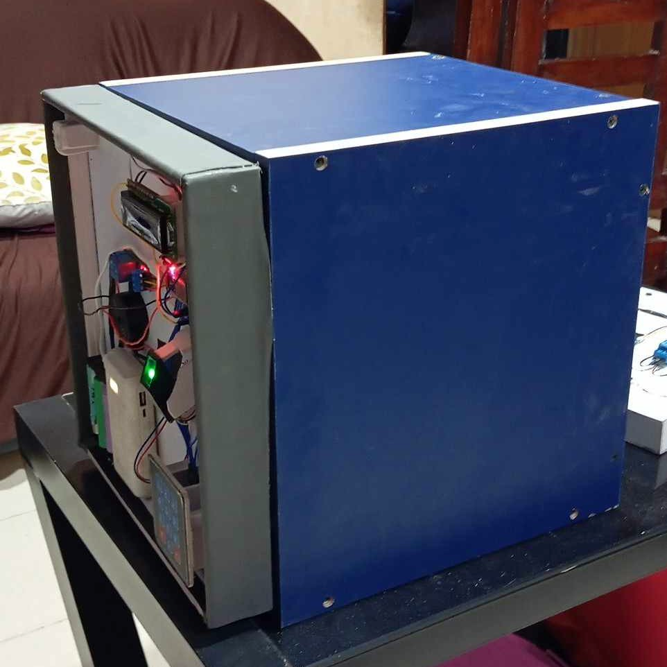

# ESP32 Biometric Locker System

A secure electronic locking system that combines fingerprint recognition and PIN code access using an ESP32 microcontroller, ZA620_M5 fingerprint sensor, and a keypad interface.

  

## Features

- **Dual Authentication Methods**: Access via fingerprint scan or 4-digit PIN code
- **LCD Status Display**: Real-time feedback with custom icons
- **Security Measures**: 
  - Lockout mechanism after 5 incorrect password attempts
  - Auto backlight timeout after 10 seconds of inactivity
  - PIN masking for privacy
- **Audible Feedback**: Different buzzer patterns for various events
- **Serial Management Interface**: Enroll or delete fingerprints via serial commands
- **Power-Efficient**: Automatic LCD backlight control

## Hardware Requirements

- ESP32 Development Board
- ZA620_M5 Fingerprint Sensor
- 4x3 Matrix Keypad
- 16x2 I2C LCD Display (I2C address 0x27)
- 5V Relay Module
- Piezo Buzzer
- Power Supply (5V)
- Jumper Wires/Solid wires
- Electronic Lock Mechanism (Solenoid/Motor)

## Wiring Connections

| Component | Pin Connection |
|-----------|---------------|
| **Fingerprint Sensor** | RX → ESP32 GPIO16 TX → ESP32 GPIO17 |
| **I2C LCD** | SDA → ESP32 SDA (21) SCL → ESP32 SCL (22) |
| **Keypad** | Row Pins → ESP32 GPIO2, GPIO0, GPIO4, GPIO5 Column Pins → ESP32 GPIO18, GPIO19, GPIO23 |
| **Relay** | Signal → ESP32 GPIO26 |
| **Buzzer** | Positive → ESP32 GPIO15 |

## Installation

1. Install the following libraries using the Arduino Library Manager:
   - Adafruit Fingerprint Sensor Library
   - Keypad
   - LiquidCrystal I2C

2. Connect the hardware components according to the wiring diagram.

3. Upload the code to your ESP32 using the Arduino IDE.

4. Open the Serial Monitor at 115200 baud to interact with the system.

## Usage

### Normal Operation

1. The system displays "Ready to unlock" when idle.
2. To unlock using fingerprint: Place your finger on the sensor.
3. To unlock using PIN: Enter the 4-digit code on the keypad.
   - Default password: `0000`
   - Press `*` to clear input
   - Press `#` to confirm (or wait for auto-confirmation after 4 digits)

### Administration

Connect to the system via Serial Monitor (115200 baud) and use the following commands:

- `e` - Enroll a new fingerprint
  - Follow the prompts to assign an ID and register a fingerprint
- `d` - Delete a stored fingerprint
  - Enter the ID of the fingerprint to delete

## Security Features

- **Lockout**: After 5 failed password attempts, the system locks for 30 seconds
- **Activity Timeout**: LCD backlight turns off after 10 seconds of inactivity
- **Input Masking**: Password digits are displayed as asterisks
- **Hardware Security**: Uses secure communications with the fingerprint sensor

## Customization

- Change the default PIN by modifying `const String DEFAULT_PASSWORD = "0000";`
- Adjust lockout duration by changing `const unsigned long LOCKOUT_DURATION = 30000;`
- Modify the inactivity timeout period with `const unsigned long INACTIVITY_TIMEOUT = 10000;`

## Troubleshooting

- **Fingerprint Sensor Not Connecting**: The code attempts to use an alternate password if the default doesn't work
- **LCD Not Displaying**: Check the I2C address (default is 0x27)
- **Relay Not Triggering**: Note that the code uses reversed logic (HIGH = locked)

## License

This project is licensed under the MIT License - see the LICENSE file for details.

## Acknowledgments

- Adafruit for their Fingerprint Sensor Library
- Arduino community for various library contributions
