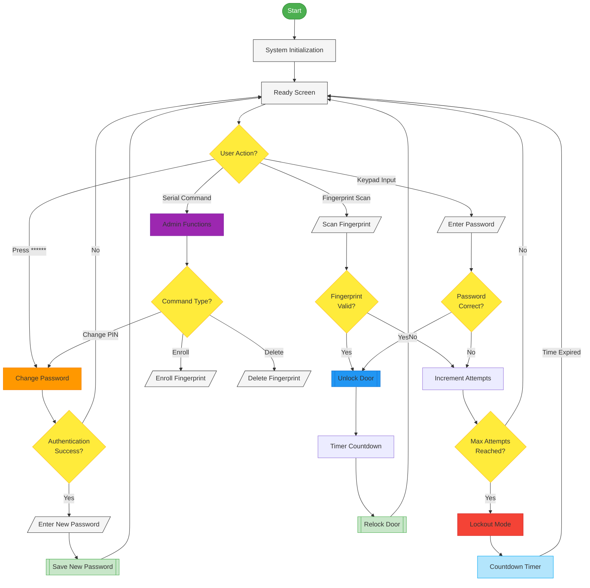

# 🔒 ESP32 Biometric Locker System

A secure, reliable electronic locker system powered by ESP32 with fingerprint and keypad authentication.

## ✨ Features

- **Dual Authentication**: Fingerprint sensor (ZW101) and keypad options
- **LCD Display**: Real-time status and feedback via I2C LCD
- **Security Features**: 
  - Lockout after multiple failed attempts
  - Auto-dimming display to save power
  - Masked password input
- **Audible Feedback**: Different sound patterns for various actions
- **Serial Management**: Enroll/delete fingerprints via serial commands

## 🛠️ Hardware

- ESP32 development board
- ZA620_M5 fingerprint sensor
- 4x3 keypad matrix
- 16x2 I2C LCD display
- Relay module for lock control
- Piezo buzzer for audio feedback

## 📋 Pin Configuration

| Component | Pins |
|-----------|------|
| Relay | GPIO26 |
| Fingerprint RX/TX | GPIO16/GPIO17 |
| Buzzer | GPIO15 |
| Keypad Rows | GPIO2, GPIO0, GPIO4, GPIO5 |
| Keypad Columns | GPIO18, GPIO19, GPIO23 |
| LCD | I2C (SDA/SCL default pins) |

## 🚀 Setup Instructions

1. Connect all components according to the pin configuration
2. Install the required libraries:
   - Adafruit Fingerprint Library
   - SimpleKeypad Library
   - LCD_I2C Library
3. Upload the code to your ESP32
4. Open the serial monitor at 115200 baud to view system status

## 💻 Usage

### Unlock Methods

- **Fingerprint**: Place registered finger on the sensor
- **Keypad**: Enter the 4-digit PIN (default: 0000)

### Management Commands

Send these commands via the Serial Monitor:

- `e` - Enroll a new fingerprint
- `d` - Delete a stored fingerprint

## 🔐 Security Features

- **Lockout System**: After 5 incorrect attempts, system locks for 30 seconds
- **Inactivity Timeout**: Display backlight turns off after 10 seconds of inactivity
- **Secure Input**: Password input is masked on the display

## 🧩 System Workflow

## 📝 Customization

- Change the default password by modifying `DEFAULT_PASSWORD`
- Adjust the lockout duration by changing `LOCKOUT_DURATION`
- Modify the number of allowed attempts by changing `MAX_WRONG_ATTEMPTS`
- Customize inactivity timeout with `INACTIVITY_TIMEOUT`

## 📜 License

This project is licensed under the MIT License - see the LICENSE file for details.

## 🙏 Acknowledgements

- Adafruit for their excellent fingerprint sensor library

---

Made with ❤️ by Aikel01
